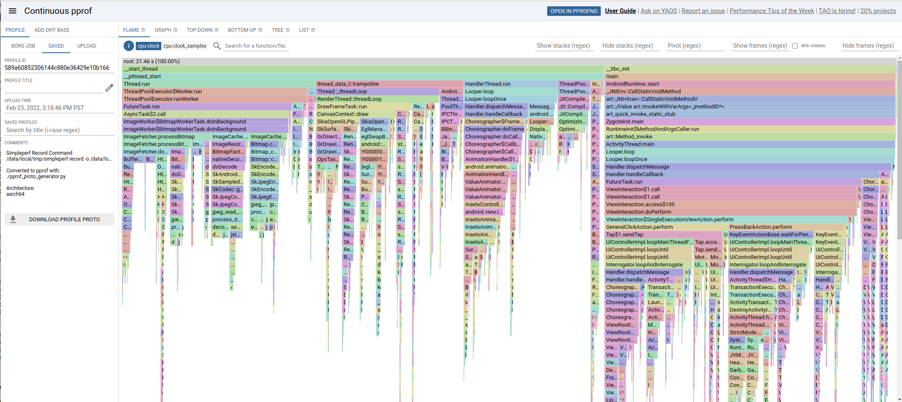
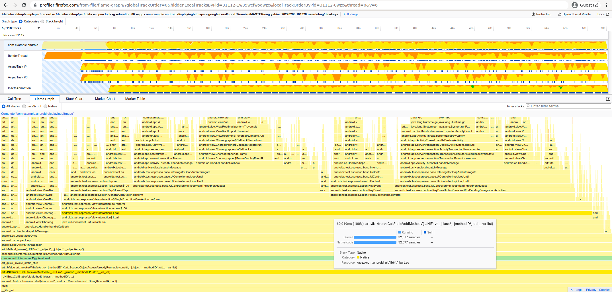
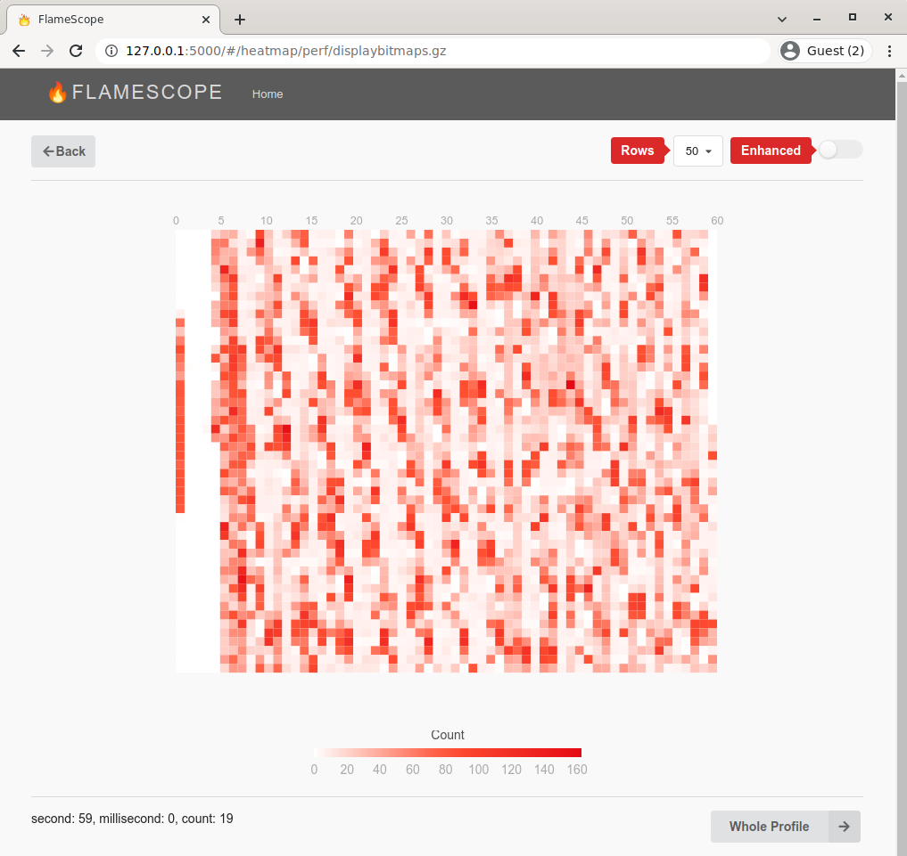
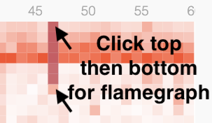
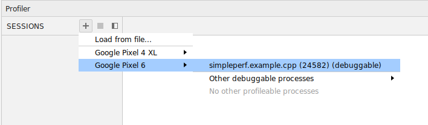
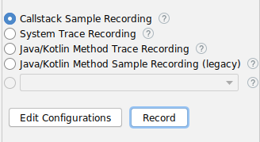
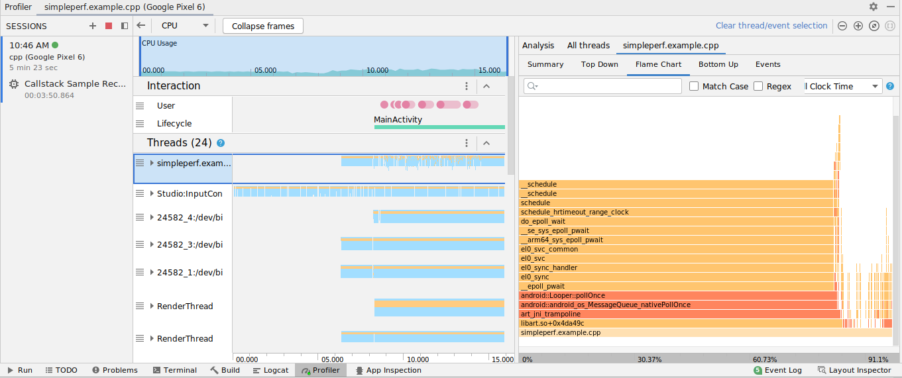
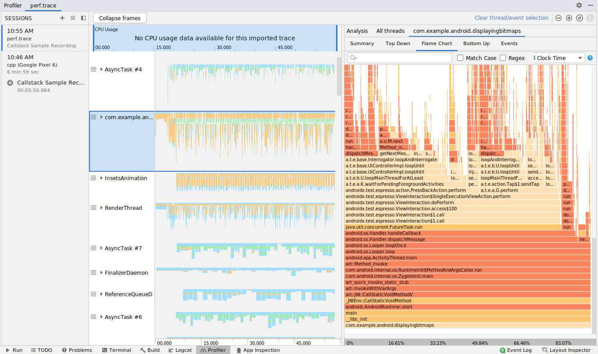
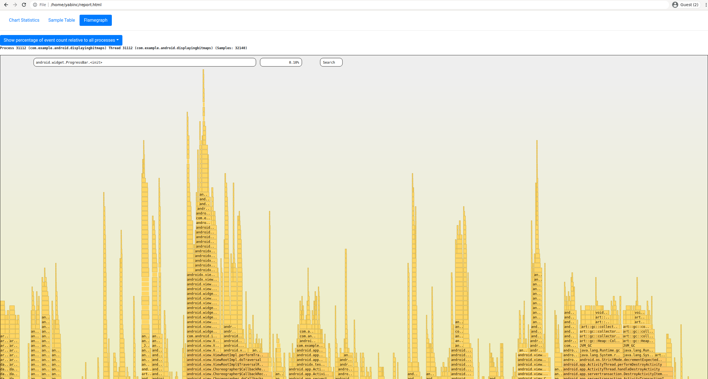
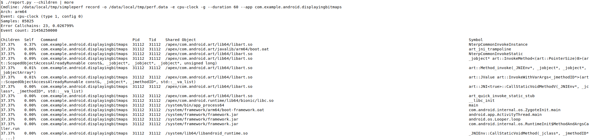

# View the profile

[TOC]

## Introduction

After using `simpleperf record` or `app_profiler.py`, we get a profile data file. The file contains
a list of samples. Each sample has a timestamp, a thread id, a callstack, events (like cpu-cycles
or cpu-clock) used in this sample, etc. We have many choices for viewing the profile. We can show
samples in chronological order, or show aggregated flamegraphs. We can show reports in text format,
or in some interactive UIs.

Below shows some recommended UIs to view the profile. Google developers can find more examples in
[go/gmm-profiling](go/gmm-profiling?polyglot=linux-workstation#viewing-the-profile).


## Continuous PProf UI (great flamegraph UI, but only available internally)

[PProf](https://github.com/google/pprof) is a mature profiling technology used extensively on
Google servers, with a powerful flamegraph UI, with strong drilldown, search, pivot, profile diff,
and graph visualisation.



We can use `pprof_proto_generator.py` to convert profiles into pprof.profile protobufs for use in
pprof.

```
# Output all threads, broken down by threadpool.
./pprof_proto_generator.py

# Use proguard mapping.
./pprof_proto_generator.py --proguard-mapping-file proguard.map

# Just the main (UI) thread (query by thread name):
./pprof_proto_generator.py --comm com.example.android.displayingbitmaps
```

This will print some debug logs about Failed to read symbols: this is usually OK, unless those
symbols are hotspots.

Upload pprof.profile to http://pprof/ UI:

```
# Upload all threads in profile, grouped by threadpool.
# This is usually a good default, combining threads with similar names.
pprof --flame --tagroot threadpool pprof.profile

# Upload all threads in profile, grouped by individual thread name.
pprof --flame --tagroot thread pprof.profile

# Upload all threads in profile, without grouping by thread.
pprof --flame pprof.profile
This will output a URL, example: https://pprof.corp.google.com/?id=589a60852306144c880e36429e10b166
```

## Firefox Profiler (great chronological UI)

We can view Android profiles using Firefox Profiler: https://profiler.firefox.com/. This does not
require Firefox installation -- Firefox Profiler is just a website, you can open it in any browser.



Firefox Profiler has a great chronological view, as it doesn't pre-aggregate similar stack traces
like pprof does.

We can use `gecko_profile_generator.py` to convert raw perf.data files into a Firefox Profile, with
Proguard deobfuscation.

```
# Create Gecko Profile
./gecko_profile_generator.py | gzip > gecko_profile.json.gz

# Create Gecko Profile using Proguard map
./gecko_profile_generator.py --proguard-mapping-file proguard.map | gzip > gecko_profile.json.gz
```

Then drag-and-drop gecko_profile.json.gz into https://profiler.firefox.com/.

Firefox Profiler supports:

1. Aggregated Flamegraphs
2. Chronological Stackcharts

And allows filtering by:

1. Individual threads
2. Multiple threads (Ctrl+Click thread names to select many)
3. Timeline period
4. Stack frame text search

## FlameScope (great jank-finding UI)

[Netflix's FlameScope](https://github.com/Netflix/flamescope) is a rough, proof-of-concept UI that
lets you spot repeating patterns of work by laying out the profile as a subsecond heatmap.

Below, each vertical stripe is one second, and each cell is 10ms. Redder cells have more samples.
See https://www.brendangregg.com/blog/2018-11-08/flamescope-pattern-recognition.html for how to
spot patterns.

This is an example of a 60s DisplayBitmaps app Startup Profile.



You can see:

  The thick red vertical line on the left is startup.
  The long white vertical sections on the left shows the app is mostly idle, waiting for commands
  from instrumented tests.
  Then we see periodically red blocks, which shows the app is periodically busy handling commands
  from instrumented tests.

Click the start and end cells of a duration:



To see a flamegraph for that duration:


Install and run Flamescope:

```
git clone https://github.com/Netflix/flamescope ~/flamescope
cd ~/flamescope
pip install -r requirements.txt
npm install
npm run webpack
python3 run.py
```

Then open FlameScope in-browser: http://localhost:5000/.

FlameScope can read gzipped perf script format profiles. Convert simpleperf perf.data to this
format with `report_sample.py`, and place it in Flamescope's examples directory:

```
# Create `Linux perf script` format profile.
report_sample.py | gzip > ~/flamescope/examples/my_simpleperf_profile.gz

# Create `Linux perf script` format profile using Proguard map.
report_sample.py \
  --proguard-mapping-file proguard.map \
  | gzip > ~/flamescope/examples/my_simpleperf_profile.gz
```

Open the profile "as Linux Perf", and click start and end sections to get a flamegraph of that
timespan.

To investigate UI Thread Jank, filter to UI thread samples only:

```
report_sample.py \
  --comm com.example.android.displayingbitmaps \ # UI Thread
  | gzip > ~/flamescope/examples/uithread.gz
```

Once you've identified the timespan of interest, consider also zooming into that section with
Firefox Profiler, which has a more powerful flamegraph viewer.

## Differential FlameGraph

See Brendan Gregg's [Differential Flame Graphs](https://www.brendangregg.com/blog/2014-11-09/differential-flame-graphs.html) blog.

Use Simpleperf's `stackcollapse.py` to convert perf.data to Folded Stacks format for the FlameGraph
toolkit.

Consider diffing both directions: After minus Before, and Before minus After.

If you've recorded before and after your optimisation as perf_before.data and perf_after.data, and
you're only interested in the UI thread:

```
# Generate before and after folded stacks from perf.data files
./stackcollapse.py --kernel --jit -i perf_before.data \
  --proguard-mapping-file proguard_before.map \
  --comm com.example.android.displayingbitmaps \
  > perf_before.folded
./stackcollapse.py --kernel --jit -i perf_after.data \
  --proguard-mapping-file proguard_after.map \
  --comm com.example.android.displayingbitmaps \
  > perf_after.folded

# Generate diff reports
FlameGraph/difffolded.pl -n perf_before.folded perf_after.folded \
  | FlameGraph/flamegraph.pl > diff1.svg
FlameGraph/difffolded.pl -n --negate perf_after.folded perf_before.folded \
  | FlameGraph/flamegraph.pl > diff2.svg
```

## Android Studio Profiler

Android Studio Profiler supports recording and reporting profiles of app processes. It supports
several recording methods, including one using simpleperf as backend. You can use Android Studio
Profiler for both recording and reporting.

In Android Studio:
Open View -> Tool Windows -> Profiler
Click + -> Your Device -> Profileable Processes -> Your App



Click into "CPU" Chart

Choose Callstack Sample Recording. Even if you're using Java, this provides better observability,
into ART, malloc, and the kernel.



Click Record, run your test on the device, then Stop when you're done.

Click on a thread track, and "Flame Chart" to see a chronological chart on the left, and an
aggregated flamechart on the right:



If you want more flexibility in recording options, or want to add proguard mapping file, you can
record using simpleperf, and report using Android Studio Profiler.

We can use `simpleperf report-sample` to convert perf.data to trace files for Android Studio
Profiler.

```
# Convert perf.data to perf.trace for Android Studio Profiler.
# If on Mac/Windows, use simpleperf host executable for those platforms instead.
bin/linux/x86_64/simpleperf report-sample --show-callchain --protobuf -i perf.data -o perf.trace

# Convert perf.data to perf.trace using proguard mapping file.
bin/linux/x86_64/simpleperf report-sample --show-callchain --protobuf -i perf.data -o perf.trace \
    --proguard-mapping-file proguard.map
```

In Android Studio: Open File -> Open -> Select perf.trace




## Simpleperf HTML Report

Simpleperf can generate its own HTML Profile, which is able to show Android-specific information
and separate flamegraphs for all threads, with a much rougher flamegraph UI.



This UI is fairly rough; we recommend using the Continuous PProf UI or Firefox Profiler instead. But
it's useful for a quick look at your data.

Each of the following commands take as input ./perf.data and output ./report.html.

```
# Make an HTML report.
./report_html.py

# Make an HTML report with Proguard mapping.
./report_html.py --proguard-mapping-file proguard.map
```

This will print some debug logs about Failed to read symbols: this is usually OK, unless those
symbols are hotspots.

See also [report_html.py's README](scripts_reference.md#report_htmlpy) and `report_html.py -h`.


## PProf Interactive Command Line

Unlike Continuous PProf UI, [PProf](https://github.com/google/pprof) command line is publicly
available, and allows drilldown, pivoting and filtering.

The below session demonstrates filtering to stack frames containing processBitmap.

```
$ pprof pprof.profile
(pprof) show=processBitmap
(pprof) top
Active filters:
   show=processBitmap
Showing nodes accounting for 2.45s, 11.44% of 21.46s total
      flat  flat%   sum%        cum   cum%
     2.45s 11.44% 11.44%      2.45s 11.44%  com.example.android.displayingbitmaps.util.ImageFetcher.processBitmap
```

And then showing the tags of those frames, to tell what threads they are running on:

```
(pprof) tags
 pid: Total 2.5s
      2.5s (  100%): 31112

 thread: Total 2.5s
         1.4s (57.21%): AsyncTask #3
         1.1s (42.79%): AsyncTask #4

 threadpool: Total 2.5s
             2.5s (  100%): AsyncTask #%d

 tid: Total 2.5s
      1.4s (57.21%): 31174
      1.1s (42.79%): 31175
```

Contrast with another method:

```
(pprof) show=addBitmapToCache
(pprof) top
Active filters:
   show=addBitmapToCache
Showing nodes accounting for 1.05s, 4.88% of 21.46s total
      flat  flat%   sum%        cum   cum%
     1.05s  4.88%  4.88%      1.05s  4.88%  com.example.android.displayingbitmaps.util.ImageCache.addBitmapToCache
```

For more information, see the [pprof README](https://github.com/google/pprof/blob/master/doc/README.md#interactive-terminal-use).


## Simpleperf Report Command Line

The simpleperf report command reports profiles in text format.



You can call `simpleperf report` directly or call it via `report.py`.

```
# Report symbols in table format.
$ ./report.py --children

# Report call graph.
$ bin/linux/x86_64/simpleperf report -g -i perf.data
```

See also [report command's README](executable_commands_reference.md#The-report-command) and
`report.py -h`.


## Custom Report Interface

If the above View UIs can't fulfill your need, you can use `simpleperf_report_lib.py` to parse
perf.data, extract sample information, and feed it to any views you like.

See [simpleperf_report_lib.py's README](scripts_reference.md#simpleperf_report_libpy) for more
details.
